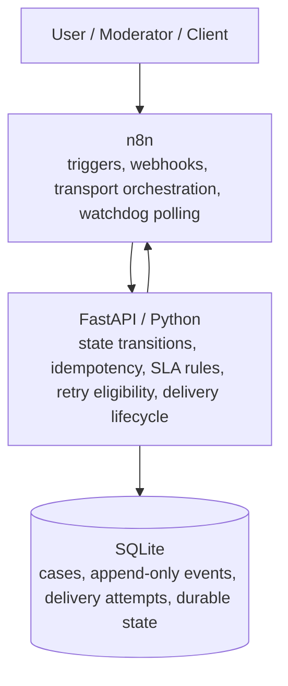

# Open Loop Tracker

Open Loop Tracker is a local automation and process-memory project for moving a support case between a moderator and a client without losing the business context when a delivery fails or n8n restarts.

## Problem

A case is not complete when a message is merely sent. It must retain its current owner, audit history, delivery outcome, retry eligibility, and SLA obligations. This project keeps those facts durable while n8n orchestrates when and where work is transported.

## Architecture



- **n8n owns when, where, and transport orchestration.** It receives webhooks, runs scheduled watchdogs, and calls the deterministic local transport.
- **FastAPI/Python owns whether an action may happen.** It applies the case state machine, idempotency, SLA rules, retry policy, and delivery lifecycle.
- **SQLite owns what happened.** It is the system of record for cases, append-only events, and delivery attempts. n8n never accesses SQLite directly.

## Main lifecycle

`NEW` → client request delivered → `WAITING_CLIENT` → client reply recorded and moderator notified → `WAITING_MODERATOR` → moderator confirms the answer → `CLOSED`.

The case event history records `CASE_CREATED`, `CLIENT_REQUEST_SENT`, `CLIENT_REPLY_RECEIVED`, `MODERATOR_NOTIFIED`, `USER_ANSWER_CONFIRMED`, and `CASE_CLOSED` as applicable.

## Reliability guarantees

- Idempotent case commands and delivery start/result commands.
- Append-only business and delivery events.
- Persistent delivery attempts, fixed retry delay, and a maximum-attempt limit.
- Read-only retry discovery; the backend decides eligibility.
- Recovery reuses an existing pending retry after a crash instead of creating the next attempt.
- SLA watchdog acknowledgements have persistent deduplication keys.
- A successful delivery produces its business effect once, even with duplicate polling.
- Restart recovery works because workflow publication is stored in `n8n_data` and business state is stored in SQLite; no workflow-local durable state is required.

## Local setup

Prerequisites: Docker Compose v2. No external credentials, paid services, or database setup are required.

```powershell
git clone https://github.com/got30017-cyber/open-loop-tracker.git
cd open-loop-tracker
Copy-Item .env.example .env
docker compose up --build -d
docker compose ps
Invoke-RestMethod http://localhost:8000/health
```

FastAPI is available at `http://localhost:8000`; n8n is available at `http://localhost:5678`. SQLite initializes automatically in the named `open_loop_data` volume. n8n state is kept in the named `n8n_data` volume.

### Import n8n workflows

On first use, open n8n, finish local owner setup, and import each JSON file in `n8n/workflows/`:

- Case Intake
- Send Client Request
- Client Reply Intake
- Moderator Answer Confirmation
- SLA Watchdog
- Delivery Recovery Watchdog

Activate each imported workflow. Source-controlled workflow JSON intentionally uses `active: false`, so importing alone does not enable schedule triggers. The watchdog workflows each include a Manual Trigger for a one-off run.

## Canonical happy-path demo

Use the active **Case Intake**, **Send Client Request**, **Client Reply Intake**, and **Moderator Answer Confirmation** workflows. This takes about 5–10 minutes including first-time workflow import.

```powershell
$case = Invoke-RestMethod -Method Post `
  -Uri http://localhost:5678/webhook/case-intake `
  -ContentType application/json `
  -Body (@{ original_message='Where is my order?'; moderator_id='moderator-1'; client_contact_id='client-1' } | ConvertTo-Json)

Invoke-RestMethod -Method Post `
  -Uri http://localhost:5678/webhook/send-client-request `
  -ContentType application/json `
  -Body (@{ public_id=$case.public_id } | ConvertTo-Json)

Invoke-RestMethod -Method Post `
  -Uri http://localhost:5678/webhook/client-reply-intake `
  -ContentType application/json `
  -Body (@{ public_id=$case.public_id; external_message_id='demo-reply-1'; text='The order ships tomorrow'; sender_id='client-1' } | ConvertTo-Json)

Invoke-RestMethod -Method Post `
  -Uri http://localhost:5678/webhook/moderator-answer-confirmation `
  -ContentType application/json `
  -Body (@{ public_id=$case.public_id } | ConvertTo-Json)

Invoke-RestMethod "http://localhost:8000/api/v1/cases/$($case.public_id)"
Invoke-RestMethod "http://localhost:8000/api/v1/cases/$($case.public_id)/events"
```

Expected states are `NEW`, `WAITING_CLIENT`, `WAITING_MODERATOR`, then `CLOSED`. The event history shows one business effect for each transition.

## Failure and recovery demo

Set `DELIVERY_RETRY_DELAY_MINUTES=1` and `RECOVERY_DEMO_FORCE_FAILURE=false` in `.env`, then recreate n8n if you changed its flag:

```powershell
docker compose up -d --force-recreate n8n
```

Create a case and record a failed client-request attempt through FastAPI:

```powershell
$case = Invoke-RestMethod -Method Post -Uri http://localhost:8000/api/v1/cases -ContentType application/json -Body (@{ original_message='Recovery demo'; moderator_id='moderator-r'; client_contact_id='client-r' } | ConvertTo-Json)
$key = "client-request:$($case.public_id)"
$attempt = Invoke-RestMethod -Method Post -Uri http://localhost:8000/api/v1/deliveries/attempts -ContentType application/json -Body (@{ case_public_id=$case.public_id; delivery_type='CLIENT_REQUEST'; recipient_id='client-r'; idempotency_key=$key } | ConvertTo-Json)
Invoke-RestMethod -Method Post -Uri "http://localhost:8000/api/v1/deliveries/$key/attempts/$($attempt.attempt_number)/result" -ContentType application/json -Body (@{ status='FAILED'; error_message='demo failure' } | ConvertTo-Json)
```

After the delay, `GET /api/v1/deliveries/retryable` exposes the logical delivery. Run **Delivery Recovery Watchdog** manually or wait for its one-minute schedule. It creates or reuses attempt 2, reports success, and produces exactly one `CLIENT_REQUEST_SENT` event:

```powershell
Start-Sleep -Seconds 70
Invoke-RestMethod http://localhost:8000/api/v1/deliveries/retryable
Invoke-RestMethod "http://localhost:8000/api/v1/cases/$($case.public_id)/events"
```

## Configuration

Copy `.env.example` to `.env` to override Compose defaults. SLA values are minutes. The documented defaults are client `120/360/1440`, moderator `30/120/240`, and delivery retries `3` attempts with a five-minute delay. The failure flags affect only the deterministic local demo transport.

## Tests and validation

```powershell
cd backend
python -m venv .venv
.venv\Scripts\Activate.ps1
pip install -r requirements.txt
pytest
cd ..
docker compose config
Get-ChildItem n8n/workflows/*.json | ForEach-Object { Get-Content -Raw $_ | ConvertFrom-Json | Out-Null }
```

## Smoke checklist

- [ ] `GET /health` returns healthy.
- [ ] Create a case and send the client request.
- [ ] Submit a client reply and see `WAITING_MODERATOR`.
- [ ] Confirm the moderator answer and see `CLOSED`.
- [ ] Fail one delivery, recover it, and see one business event.
- [ ] Restart only n8n; confirm active workflows remain available and a persisted retry can still recover.

## Portfolio scope and limitations

This is deliberately a local Docker Compose portfolio/demo project: SQLite, deterministic local/mock transport, no authentication, no cloud deployment, and no Telegram, Slack, email, or other real provider integration. It has no external paid services and no runtime LLM dependency. These are scope choices, not production-readiness claims.